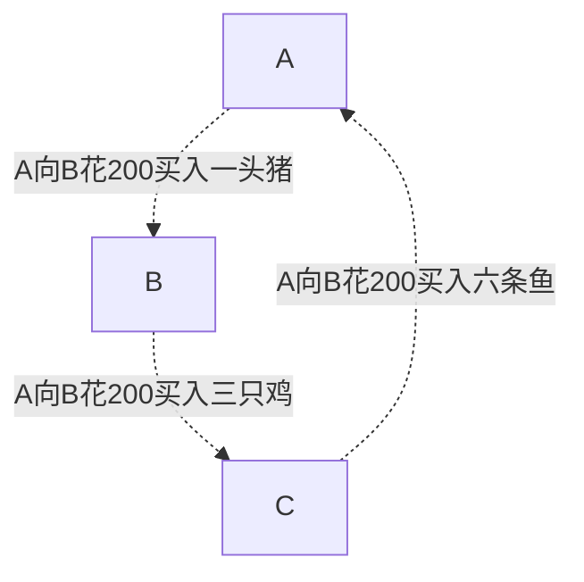

title: 投资从入门到放弃
speaker: 
plugins:
    - echarts
    - mermaid: {theme: forest}

<slide class="bg-black-blue aligncenter" image="https://images.unsplash.com/photo-1518458028785-8fbcd101ebb9?ixlib=rb-1.2.1&ixid=eyJhcHBfaWQiOjEyMDd9&auto=format&fit=crop&w=500&q=60">

# 投资系列-理财篇 {.text-landing.text-shadow}
---

做一件事情最好的时间是10年前，其次就是现在！ {.text-intro}


<slide :class='size-70 aligncenter'>

## 货币历史
---


以物易物

<slide :class='size-70 aligncenter'>

## 贝币
---


<slide :class='size-70 aligncenter'>

## 金属货币
---


<slide :class='size-70 aligncenter'>

## 世界上最早的纸币——交子
---


<slide :class='size-70 aligncenter'>

## 袁大头
---


<slide :class='size-70 aligncenter'>

## 人民币
---


<slide class="bg-black-blue aligncenter" image="https://images.unsplash.com/photo-1554672723-d42a16e533db?ixlib=rb-1.2.1&ixid=eyJhcHBfaWQiOjEyMDd9&auto=format&fit=crop&w=800&q=60">

## 通货膨胀 {.text-landing.text-shadow}
<slide :class='size-70 aligncenter'>

## 什么是通货膨胀？
---
货币的发行量超过了商品流通实际需要的货币数量，从而引起的货币贬值 {.animated.delay-1s}

<slide :class='size-70 aligncenter'>


## 举个🌰
---
在一个小岛上只有100个商品，岛上流通的总货币是500元

那么每个商品的单价是5元 {.animated.delay-1s}

<slide :class='size-70 aligncenter'>
## 如果商品数保持不变
---
总货币上涨到1000元（国家印钱）

那么每个商品的单价是10元 {.animated.delay-1s}

<slide :class='size-70 aligncenter'>

## 小故事
---
美国政府在3月份推出2.2万亿的经济刺激计划

<slide :class='size-70 aligncenter'>

## 那么我国的通货膨胀率是多少呢？
<slide :class='size-70 aligncenter'>

## CPI（消费者物价指数）
---
反应我们生活中的大众商品和劳务价格的变动指标
<slide :class='size-70 aligncenter'>

## M2增长率 - GDP增长率 
---
M2就是指「广义货币的数量」

GDP就是指「国内生产总值」

<slide :class='size-60 aligncenter'>

## 答案是：7%左右

<slide :class='size-60 aligncenter'>

## 通货膨胀下的资金变化
---
```echarts {style="height:100%;width:100%;"}
{
    xAxis: {
        type: 'category',
        boundaryGap: false,
        data: ['0','第1年', '第2年', '第3年', '第4年', '第5年', '第6年', '第7年', '第8年', '第9年', '第10年']
    },
    yAxis: {
        name:'（万）',
        type: 'value',
    },
    series: [{
        data: [10,9.3,8.65,8.04,7.48, 6.956,6.47,6.02,5.596,5.2,4.84],
        type: 'line',
        label: {
                normal: {
                    show: true,
                    position: 'top'
                }
            },
    }]
}
```
<slide :class='size-70 aligncenter'>

## 那国家不印钱不就行了?
---

<slide :class='size-70 aligncenter'>

## 经济流通
---


这里的一头🐷、三只🐔和六条🐟就是流通过程中产生的价值 {.animated.delay-1s}

<slide :class='size-70 aligncenter'>

## 经济流通产生的价值越多证明国家的经济实力越强

<slide :class='size-70 aligncenter'>

## 如何解决通货膨胀带来的问题呢？
---

<slide :class='size-70 aligncenter'>

## 攒资产（~~攒钱~~）

---
资产就是给你带来被动收入的 

<slide :class='size-70 aligncenter'>


## 资产类型
---
* 房子
* 活期
* 定期
* 黄金
* 基金
* 股票
* 其它 


<slide class="bg-black-blue aligncenter" image="https://images.unsplash.com/photo-1549421263-6064833b071b?ixlib=rb-1.2.1&ixid=eyJhcHBfaWQiOjEyMDd9&auto=format&fit=crop&w=800&q=60">
## 股票指数 {.text-landing.text-shadow}

<slide class="aligncenter">

## 交易所
---
  * 1602年，东印度公司成立 **阿姆斯特丹证券交易所**（世界最古老的）
  * 1790年，美国成立第一所**费城交易所**
  * 1792年，24位经纪人在纽约华尔街68号前签署 **「梧桐树协议」**
  * 1863年，正式改名为**纽约证劵交易所**

<slide :class='size-70 aligncenter'>

* 道琼斯指数
* 标准普尔指数
* 纳斯达克指数


<slide :class='size-70 aligncenter'>

## 熔断机制
---
* 2020年3月9日
* 2020年3月12日
* 2020年3月16日
* 2020年3月18日
  
<slide :class='size-70 aligncenter'>

## 资产类型
---
* 房子
* 活期
* 定期
* 黄金
* 基金
* 股票
* 其它


<slide class="aligncenter" image="https://images.unsplash.com/photo-1591696205602-2f950c417cb9?ixlib=rb-1.2.1&ixid=eyJhcHBfaWQiOjEyMDd9&auto=format&fit=crop&w=800&q=60">

## 指数基金
<slide :class='size-70 aligncenter'>

## 什么是指数基金呢？
---
投资股票的基金

<slide :class='size-70 aligncenter'>

## 复利效应
---
公式：S = P * (1 + i)^n


<slide :class='size-70 aligncenter'>

## 定期定投策略
---
在固定的周期时间内，拿固定的金额，去投资基金
<slide :class='size-50 aligncenter'>

## 举个🌰
---

* 每次定投100元，按照计算份额的话，分别是：
100/1+100/0.6+100/0.8+100/1 = 492
* 一次买入400元，那么最后的份额是400
```echarts {style="height:100%;width:100%;"}
{
    legend: {
        data: ['每月定投100元', '一次性买入400元', ]
    },
    xAxis: {
        type: 'category',
        data: ['1月', '2月', '3月', '4月']
    },
    yAxis: {
        name: 'A基金的市值',
        type: 'value'
    },
    series: [{
        name:'每月定投100元',
        data: [1,0.5,0.8,1],
        type: 'line'
    }, {
        name:'一次性买入400元',
        data: [1,1,1,1],
        type: 'line'
    }]
}
```

<slide :class='size-50 aligncenter'>

## 再举个🌰
---

* 每次定投100元，按照计算份额的话，分别是：
100/1+100/1.2+100/0.6+100/1 = 450
* 一次买入400元，那么最后的份额是400
```echarts {style="height:100%;width:100%;"}
{
    legend: {
        data: ['每月定投100元', '一次性买入400元', ]
    },
    xAxis: {
        type: 'category',
        data: ['1月', '2月', '3月', '4月']
    },
    yAxis: {
        name: 'A基金的市值',
        type: 'value'
    },
    series: [{
        name:'每月定投100元',
        data: [1,1.2,0.6,1],
        type: 'line'
    }, {
        name:'一次性买入400元',
        data: [1,1,1,1],
        type: 'line'
    }]
}
```

<slide :class='size-70 aligncenter'>

## 如何选择指数基金呢？
---
* 确定指数类型
* 确定要投资的指数
* 选择基金公司
* 买入操作

<slide :class='size-50 aligncenter'>

## 支付宝红绿灯
---


<slide class="aligncenter" ">

## 一些建议
<slide :class='size-70 aligncenter'>

## 一、健全完善的知识体系
---
* 《小狗钱钱》
* 《穷爸爸富爸爸》
* 「四笔钱」
<slide :class='size-70 aligncenter'>

## 四笔钱
---
* 活期现金
* 稳健理财
* 长期投资
* 保险服务

<slide :class='size-70 aligncenter'>

## 二、强大的内心，平常心

<slide :class='size-70 aligncenter'>

## 三、将投资期限延长
---
一年、三年、五年、十年、二十年、三十年....

<slide :class='size-70 aligncenter'>

## 四、实践出真理
---
知行合一

<slide :class='size-70 aligncenter'>

## 五、投资是一辈子的事情
---
早就是优势，对自己的投资也别忘了


<slide class="bg-black-blue aligncenter" image="https://images.unsplash.com/photo-1512909006721-3d6018887383?ixlib=rb-1.2.1&ixid=eyJhcHBfaWQiOjEyMDd9&auto=format&fit=crop&w=500&q=60">

## 福利环节
---
请大家打开支付宝

<slide :class='size-70 aligncenter'>

## 祝大家早日实现财务自由

<slide :class='size-70 aligncenter'>

## 谢谢观看

<slide :class='size-70 aligncenter'>

## 番外篇

<slide :class='size-70 aligncenter'>

## 中国的股票历史
---
  * 1891年，**上海掮客公会**
  * 1904年, 更名为**上海证券交易所**
  * 1984年，中国的第一只股票 **「飞乐音响股票」**
  * 1986年9月26日 **上海信托静安营业部**
  * 1990年11月26日 上海证劵交易所
  * 1990年12月1日  深圳证劵交易所

<slide :class='size-70 aligncenter'>

## 中国的股票指数
---
* 上证综合指数
* 深证成本指数

<slide :class='size-70 aligncenter'>

## 出处
---
* 李永乐老师的「熔断」视频
* B站UP的视频
* 维基百科等网络